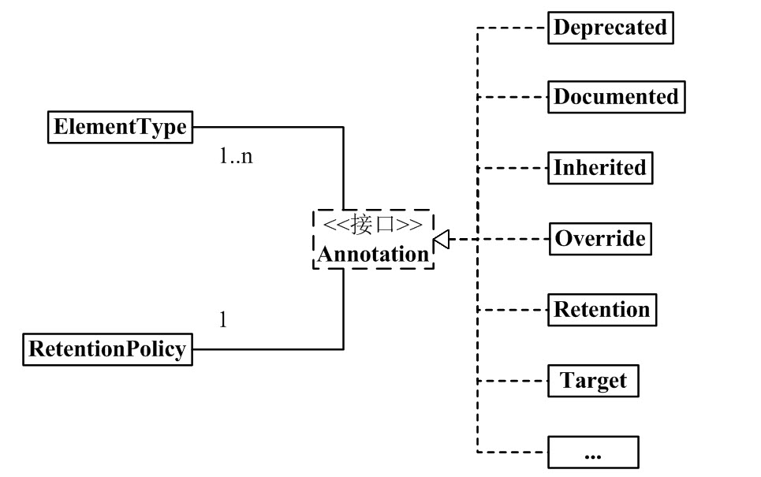

# 注解

## 1 概念

是一种注释，但可以通过反射获取其内容

## 2 内置注解

### java.lang 中的注解

+ @Override

是否是重写方法

+ @Deprecated

过时方法，不建议使用

+ @SuppressWarnings

镇压警告

### java.lang.annotation 中的元注解

+ @Retention

标识这个注解怎么保存(在什么时候生效)，是只在代码中，还是编入class文件中，或者是在运行时可以通过反射访问

参数是一个枚举类

```java
public enum RetentionPolicy {
    SOURCE,
    CLASS, //默认
    RUNTIME
}
```

+ @Documented

标记这些注解是否包含在用户文档中

+ @Target

标记这个注解应该是哪种 Java 成员

参数是一个枚举类的 list

```java
public enum ElementType {
    TYPE, //类，接口等
    FIELD, //属性
    METHOD, //方法
    PARAMETER, //参数
    CONSTRUCTOR, //构造器
    LOCAL_VARIABLE, //本地变量
    ANNOTATION_TYPE,
    PACKAGE,
    TYPE_PARAMETER,
    TYPE_USE,
    MODULE,
    RECORD_COMPONENT;
}
```

+ @Inherited

没看明白啥意思！！

### 额外注解

+ @SafeVarargs

忽略任何使用参数为泛型变量的方法或构造函数调用产生的警告

即，只能修饰构造函数和方法

+ @FunctionalInterface

标识一个匿名函数或函数式接口

+ @Repeatable

标识某注解可以在同一个声明上使用多次

## 3 Annotation 架构



一个注解有一个 Retention，多个 ElementType

## 4 Annotation 组成

有三个主要类

### java.lang.annotation.Annotation

所有注解扩展的公共接口，本身不定义注解

```java
public interface Annotation {
    boolean equals(Object obj);
    int hashCode();
    String toString();
    Class<? extends Annotation> annotationType();
}
```

+ boolean equals(Object obj);

默认是 Object 类的实现 `return this == obj;`

实现之后需要重写，比较两个相同的注解

+ int hashCode();

重写 equals 之前必须重写 hashCode，意思同上

+ String toString();

默认是 Object 类的实现，返回对象名

+ Class<? extends Annotation> annotationType();

依赖于实现的类用于提供注释的实现。
因此，对注释调用getClass将返回一个依赖于实现的类。
相反，此方法将可靠地返回注释的注释接口。


### java.lang.annotation.ElementType

上文已介绍过

### java.lang.annotation.RetentionPolicy

上文已介绍过


## 5 自定义注解

代码：src/main/java/cn/peng/annotation/Check.java

